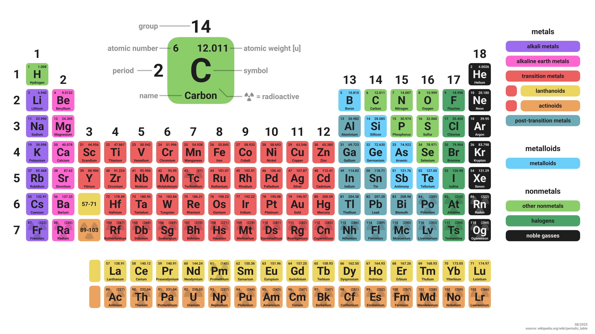

# Periodic Table
Periodic table of elements in both English and Polish.

version 08-2025:  
&nbsp;&nbsp;&nbsp;&nbsp;english:  
&nbsp;&nbsp;&nbsp;&nbsp;&nbsp;&nbsp;&nbsp;&nbsp;[en png 3200x1800](https://raw.githubusercontent.com/lowlightee/periodic_table/refs/heads/main/exported_08-2025/table_en_08-2025_3200x1800.png)  
&nbsp;&nbsp;&nbsp;&nbsp;&nbsp;&nbsp;&nbsp;&nbsp;[en png 6400x3600](https://raw.githubusercontent.com/lowlightee/periodic_table/refs/heads/main/exported_08-2025/table_en_08-2025_6400x3600.png)  
&nbsp;&nbsp;&nbsp;&nbsp;&nbsp;&nbsp;&nbsp;&nbsp;[en png 16000x9000](https://raw.githubusercontent.com/lowlightee/periodic_table/refs/heads/main/exported_08-2025/table_en_08-2025_16000x9000.png)  
&nbsp;&nbsp;&nbsp;&nbsp;&nbsp;&nbsp;&nbsp;&nbsp;[en svg text](https://raw.githubusercontent.com/lowlightee/periodic_table/refs/heads/main/exported_08-2025/table_en_08-2025_text.svg)  
&nbsp;&nbsp;&nbsp;&nbsp;&nbsp;&nbsp;&nbsp;&nbsp;[en svg shape](https://raw.githubusercontent.com/lowlightee/periodic_table/refs/heads/main/exported_08-2025/table_en_08-2025_shape.svg) (it is advised to only use this version if svg text version doesn't work)  
&nbsp;&nbsp;&nbsp;&nbsp;&nbsp;&nbsp;&nbsp;&nbsp;[en pdf](https://raw.githubusercontent.com/lowlightee/periodic_table/refs/heads/main/exported_08-2025/table_en_08-2025.pdf) (it is advised to only use this version if svg text version doesn't work)  
&nbsp;&nbsp;&nbsp;&nbsp;polish:  
&nbsp;&nbsp;&nbsp;&nbsp;&nbsp;&nbsp;&nbsp;&nbsp;[pl png 3200x1800](https://raw.githubusercontent.com/lowlightee/periodic_table/refs/heads/main/exported_08-2025/table_pl_08-2025_3200x1800.png)  
&nbsp;&nbsp;&nbsp;&nbsp;&nbsp;&nbsp;&nbsp;&nbsp;[pl png 6400x3600](https://raw.githubusercontent.com/lowlightee/periodic_table/refs/heads/main/exported_08-2025/table_pl_08-2025_6400x3600.png)  
&nbsp;&nbsp;&nbsp;&nbsp;&nbsp;&nbsp;&nbsp;&nbsp;[pl png 16000x9000](https://raw.githubusercontent.com/lowlightee/periodic_table/refs/heads/main/exported_08-2025/table_pl_08-2025_16000x9000.png)  
&nbsp;&nbsp;&nbsp;&nbsp;&nbsp;&nbsp;&nbsp;&nbsp;[pl svg text](https://raw.githubusercontent.com/lowlightee/periodic_table/refs/heads/main/exported_08-2025/table_pl_08-2025_text.svg)  
&nbsp;&nbsp;&nbsp;&nbsp;&nbsp;&nbsp;&nbsp;&nbsp;[pl svg shape](https://raw.githubusercontent.com/lowlightee/periodic_table/refs/heads/main/exported_08-2025/table_pl_08-2025_shape.svg) (it is advised to only use this version if svg text version doesn't work)  
&nbsp;&nbsp;&nbsp;&nbsp;&nbsp;&nbsp;&nbsp;&nbsp;[pl pdf](https://raw.githubusercontent.com/lowlightee/periodic_table/refs/heads/main/exported_08-2025/table_pl_08-2025.pdf) (it is advised to only use this version if svg text version doesn't work)  

Exporting to .svg in figma, by default makes the text be exported into shapes (so it can't be selected). To prevent this you should export into svg using [SVG Export with Text](https://www.figma.com/community/plugin/1417788739345122322/svg-export-with-text) plugin. Then use the font embed script.
